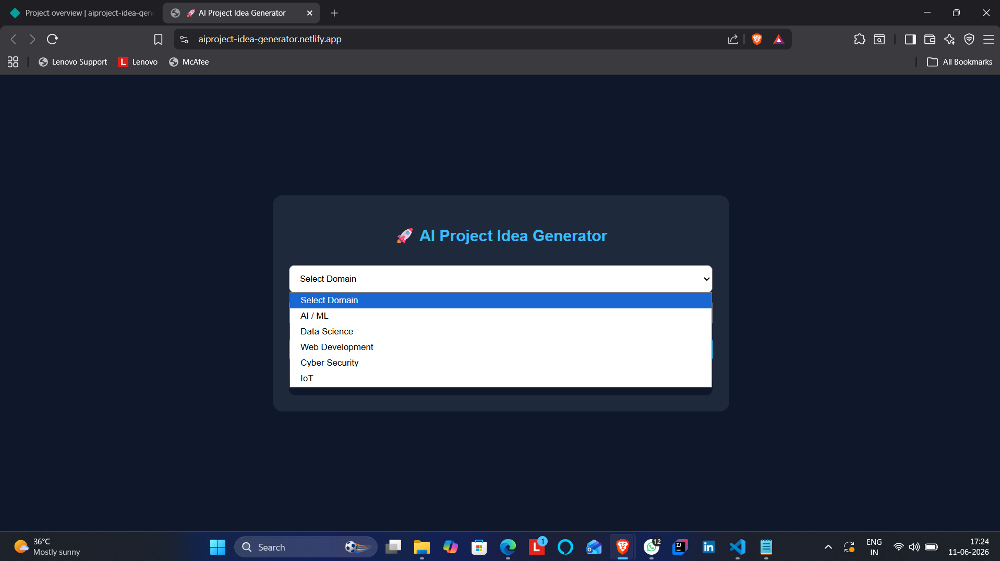

# AI Project Idea Generator

🚀 Day 3 of my 30 Days 30 AI Websites Challenge

AI Project Idea Generator is a simple web application that helps students, developers, and beginners discover project ideas based on their domain of interest and skill level.

## 🌐 Live Demo

https://aiproject-idea-generator.netlify.app/

## 📸 Screenshot

   

   

## ✨ Features

* Domain Selection
* Difficulty Level Selection
* Project Idea Generation
* Required Skills Display
* Technologies Used
* Estimated Completion Timeline

## 🎯 Supported Domains

* AI / Machine Learning
* Data Science
* Web Development
* Cyber Security
* Internet of Things (IoT)

## 📊 Supported Difficulty Levels

* Beginner
* Intermediate
* Advanced

## 🛠 Technologies Used

* HTML
* CSS
* JavaScript
* AI-Assisted Development

## 📋 How It Works

1. Select a domain.
2. Select difficulty level.
3. Click "Generate Project Idea".
4. View:

   * Project Idea
   * Required Skills
   * Technologies
   * Estimated Timeline

## 🚀 Example

Domain: AI / Machine Learning

Difficulty: Intermediate

Project Idea:
Resume Screening System

Skills:

* Python
* Machine Learning
* Data Processing

Technologies:

* Pandas
* Scikit-Learn

Timeline:
2–4 Weeks

## 🎯 Challenge

This project is part of my 30 Days 30 AI Websites Challenge where I build and publish one AI-assisted website every day.

### Progress

* Day 1 ✅ AI Resume Analyzer
* Day 2 ✅ AI Career Roadmap Generator
* Day 3 ✅ AI Project Idea Generator

## 👨‍💻 Author

Anand,

B.Tech CSE (Data Science)
